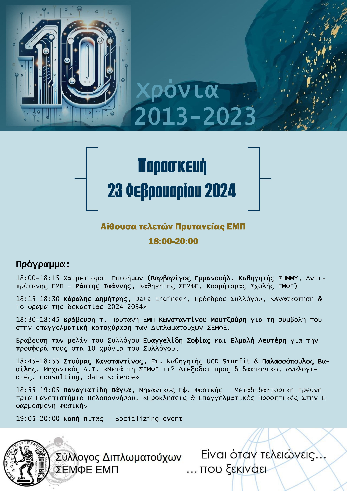

# Πρόσκληση - Εκδήλωση: 10 Χρόνια Σύλλογος Διπλωματούχων ΣΕΜΦΕ

*Αγαπητοί Απόφοιτοι 
Μέλη ΔΕΠ 
Προπτυχιακοί Φοιτητές και 
Φίλοι του Συλλόγου Διπλωματούχων ΣΕΜΦΕ,*

Με ιδιαίτερη χαρά σας προσκαλούμε στην εορταστική εκδήλωση για τα 10 χρόνια ζωής και δράσης του Συλλόγου μας. Μέσα από τη δεκαετή πορεία μας έχουμε συνδράμει αποφασιστικά στην επαγγελματική κατοχύρωση των μελών μας, δημιουργώντας ένα ισχυρό δίκτυο συνεργασίας και εμπιστοσύνης.

Η εκδήλωση θα πραγματοποιηθεί την **Παρασκευή, 23 Φεβρουαρίου 2024**, στις **18:00-20:00** στην αίθουσα εκδηλώσεων της Πρυτανείας του ΕΜΠ (Κτήριο Διοίκησης, Πολυτεχνειούπολη Ζωγράφου).

Χαιρετισμό θα απευθύνουν:

- **Βαρβαρίγος Εμμανουήλ**, Καθηγητής ΣΗΜΜΥ, Αντιπρύτανης ΕΜΠ
- **Ράπτης Ιωάννης**, Καθηγητής ΣΕΜΦΕ, Κοσμήτορας Σχολής ΕΜΦΕ

Ομιλίες:

- **Κάραλης Δημήτρης**, Data Engineer Τράπεζα Πειραιώς, Πρόεδρος Συλλόγου, *«Ανασκόπηση & Το Όραμα της δεκαετίας 2024-2034»*
- **Στούρας Κωνσταντίνος**, Επ. Καθηγητής UCD Smurfit  & **Παλασσόπουλος Βασίλης**, Μηχανικός A.I. *«Μετά τη ΣΕΜΦΕ τι? Διέξοδοι προς διδακτορικό, αναλογιστές, consulting, data science»*
- **Παναγιωτίδη Βάγια**, Μηχανικός Εφ. Φυσικής - Μεταδιδακτορική Ερευνήτρια Πανεπιστήμιο Πελλοπονήσου, *«Προκλήσεις & Επαγγελματικές Προοπτικές Στην Εφαρμοσμένη Φυσική»*

Θα βραβευτούν πρόσωπα που έχουν συμβάλει σημαντικά στην θεμελίωση της επαγγελματικής κατοχύρωσης της ΣΕΜΦΕ, καθώς και στον ίδιο το Σύλλογο:

- Ο τ. Πρύτανης ΕΜΠ και νυν Περιφερειάρχης Β. Αιγαίου κ. **Κωνσταντίνος Μουτζούρης** για την πολύτιμη συνεισφορά του αναφορικά με την απόφαση στήριξης του αιτήματος εγγραφής των Διπλωματούχων μας στο ΤΕΕ το 2009. Στο πρόσωπό του τιμούμε ολόκληρη τη Σύγκλητο του Ιδρύματος.
- Το Ιδρυτικό μέλος του Συλλόγου και πρώην Ταμίας του ΔΣ **Ευαγγελίδη Σοφία** που υπηρέτησε το Σύλλογο από θέσεις ευθύνης όλα τα προηγούμενα χρόνια.
- Το ιδρυτικό μέλος του Συλλόγου και πρώην Αντιπρόεδρος του ΔΣ **Ελμαλής Λευτέρης** που υπηρέτησε το Σύλλογο από θέσεις ευθύνης όλα τα προηγούμενα χρόνια.

Στη συνέχεια θα γίνει η κοπή πίτας. Σε αυτή θα έχουμε την ευκαιρία να ανταλλάξουμε απόψεις και να ενισχύσουμε τις σχέσεις μας, συνεχίζοντας την πολυετή παράδοση της συναδελφικότητας και της συνεργασίας που μας διακρίνει.

Σας περιμένουμε να γιορτάσουμε μαζί την πορεία και τα επιτεύγματα του Συλλόγου μας, καθώς και να αναδείξουμε τα νέα, φιλόδοξα σχέδια για την επόμενη δεκαετία.

Με εκτίμηση, 
*Το Δ.Σ. του Συλλόγου Διπλωματούχων ΣΕΜΦΕ ΕΜΠ* 
*website: [semfealumni.gr](https://semfealumni.gr)* 
*email: [gradsemfe@gmail.com](mailto:gradsemfe@gmail.com)*

{ width=600 height=800 }