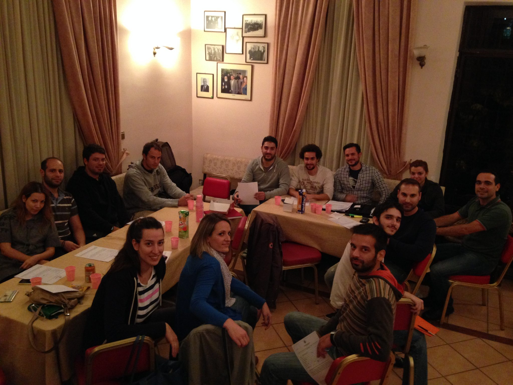

---
hide:
  - navigation
  - toc
---

# Πως ξεκινήσαμε...
Ο Σύλλογος Διπλωματούχων ΣΕΜΦΕ (o **“Σύλλογος”**) είναι ο επίσημος φορέας των Διπλωματούχων/Αποφοίτων της Σχολής Εφαρμοσμένων Μαθηματικών και Φυσικών Επιστημών του ΕΜΠ (η **“Σχολή”**). Η Ιδρυτική Συνέλευση έγινε στις 29 Οκτωβρίου 2013 στη Ζωγράφου, ενώ στη συνέχεια εγκρίθηκε και καταχωρήθηκε στο βιβλίο του Πρωτοδικείου Αθηνών. Η πρωτοβουλία ξεκίνησε από μέλη του προηγούμενου Συλλόγου Αποφοίτων καθώς και από πολλά νέα μέλη. Μέχρι τώρα, ο Σύλλογος και τα μέλη του έχουν συμβάλει αποφασιστικά σε δραστηριότητες όπως η [εξωτερική αξιολόγηση της ΣΕΜΦΕ](assets/documents/evaluations/exoterikh_axiologisi_SEMFE_2010.pdf) που σχετίζεται άμεσα με την επαγγελματική προοπτική των αποφοίτων,  η “κίνηση των 15” για τη δικαστική διεκδίκηση για ένταξη στο ΤΕΕ, στις συζητήσεις για το πρόγραμμα σπουδών της ΣΕΜΦΕ, ενώ και σε πολλές άλλες εκδηλώσεις και συναντήσεις, που έχουν να κάνουν με τους διπλωματούχους της ΣΕΜΦΕ.  Ο Σύλλογος χειρίζεται όλα τα ζητήματα που έχουν να κάνουν με την επαγγελματική κατοχύρωση των αποφοίτων της ΣΕΜΦΕ, όπως επίσης και του συντονισμού ενημερωτικών συζητήσεων και ημερίδων.

<figure markdown>
  
  <figcaption>Ιδρυτική Συνέλευση Συλλόγου Διπλωματούχων ΣΕΜΦΕ  στα γραφεία του “Συνδέσμου Παλαιών Ζωγραφιωτών”  (Ζωγράφου, Οκτώβριος 2013)</figcaption>
</figure>
