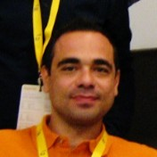
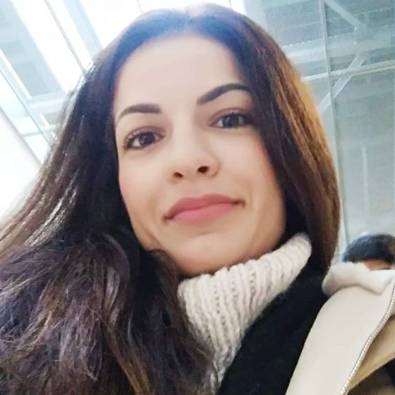
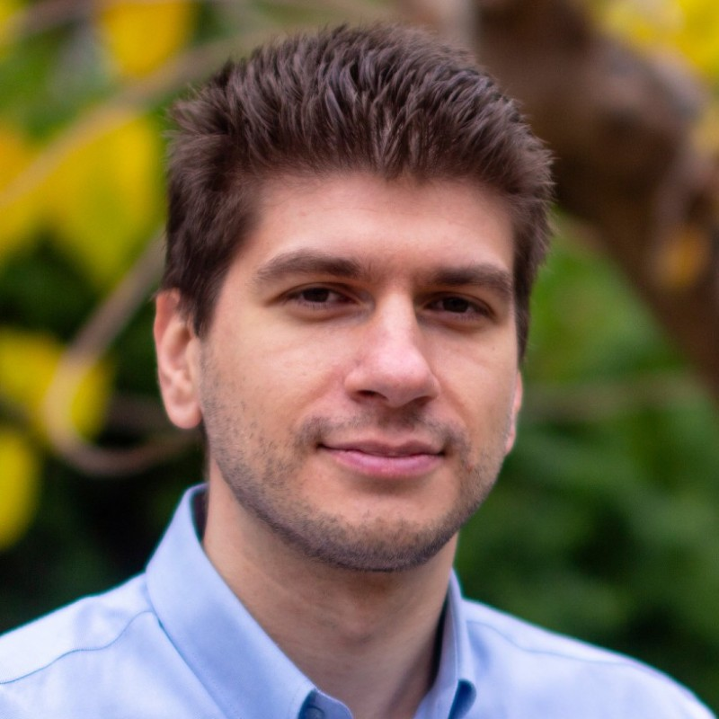
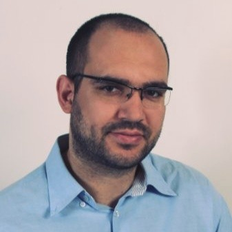
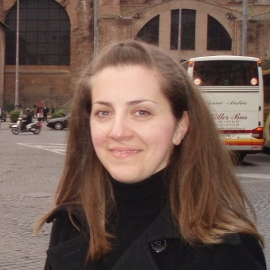

---
hide:
  - toc
---

# Διοίκηση

## Διοικητικό Συμβούλιο  2025-2027
---
{width=150 height=150 align=left}

### Πρόεδρος

#### Κάραλης Δημήτρης

[:fontawesome-brands-linkedin:{ .linkedin }dimitris-karalis-80319558](https://www.linkedin.com/in/dimitris-karalis-80319558){ .md-button }

---
{width=150 height=150 align=left}

### Αντιπρόεδρος

#### Αλμπάνης Βαγγέλης

[:fontawesome-brands-linkedin:{ .linkedin }evangelos-almpanis](https://www.linkedin.com/in/evangelos-almpanis){ .md-button }

---
{width=150 height=150 align=left}

### Γενική Γραμματέας

#### Στεργίου Αλίκη

[:fontawesome-brands-linkedin:{ .linkedin }aliki-stergiou](https://www.linkedin.com/in/aliki-stergiou-081a5a16/){ .md-button }

---
{width=150 height=150 align=left}

### Ταμίας

#### Στούρας Κωνσταντίνος

[:fontawesome-brands-linkedin:{ .linkedin }stouras](https://www.linkedin.com/in/stouras/){ .md-button }

---
{width=150 height=150 align=left}

### Μέλος

#### Παλασσόπουλος Βασίλης

[:fontawesome-brands-linkedin:{ .linkedin }palasso](https://www.linkedin.com/in/palasso/){ .md-button }

---
{width=150 height=190 align=left}

### Αναπληρωματικό Μέλος

#### Παπαθανασίου Αθανάσιος-Φοίβος

[:fontawesome-brands-linkedin:{ .linkedin }athanasios-nasos-papathanasiou-aa27b1157](https://www.linkedin.com/in/athanasios-nasos-papathanasiou-aa27b1157/){ .md-button }

---
{width=150 height=150 align=left}

### Αναπληρωματικό Μέλος

#### Μαγγίνας Γιώργος

[:fontawesome-brands-linkedin:{ .linkedin }georgiosmanginas](https://www.linkedin.com/in/georgiosmanginas/){ .md-button }

---
## Εξελεγκτική Επιτροπή  2025-2027

---
{width=150 height=150 align=left}

### Μέλος

#### Ευαγγελίδη Σοφία

 

---
{width=150 height=150 align=left}

### Μέλος

#### Παναγιωτίδη Βάγια

[:fontawesome-brands-linkedin:{ .linkedin }vayiapanagiotidis](https://www.linkedin.com/in/vayiapanagiotidis/){ .md-button }

---
{width=150 height=190 align=left}

### Μέλος

#### Γερακίνης Δημήτρης

[:fontawesome-brands-linkedin:{ .linkedin }dimitris-gerakinis](https://www.linkedin.com/in/dimitris-gerakinis/){ .md-button }

 

---
## Αποτελέσματα Αρχαιρεσιών 2025
{ type=application/pdf style="min-height:25vh;width:100%" }

## Αποτελέσματα Αρχαιρεσιών 2022

{ type=application/pdf style="min-height:25vh;width:100%" }