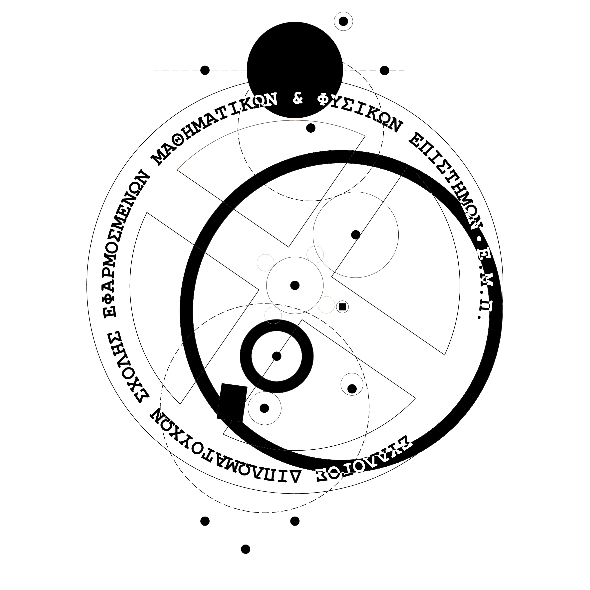

---
hide:
  - toc
---

<figure markdown>
  {width=300 height=300 align=left }
</figure>

# Σύλλογος Διπλωματούχων ΣΕΜΦΕ ΕΜΠ

## Όραμα
Ο Σύλλογος Διπλωματούχων ΣΕΜΦΕ αγωνίζεται για τη διεύρυνση των επαγγελματικών δικαιωμάτων των μελών του και για τη σύσφιξη των σχέσεων Αποφοίτων μεταξύ τους, με τη Σχολή και με τους ευρύτερους κοινωνικούς και πολιτειακούς φορείς. Οραματιζόμαστε ένα ενωμένο δίκτυο Αποφοίτων, Προπτυχιακών Φοιτητών και Καθηγητών ΣΕΜΦΕ που επικοινωνούν μεταξύ τους ενεργά για επιστημονικά και επαγγελματικά θέματα παράγωντας προστιθέμενη αξία στη Σχολή και το ΕΜΠ.

## Σκοπός
Ο Σύλλογος Διπλωματούχων της Σχολής Εφαρμοσμένων Μαθηματικών και Φυσικών Επιστημών του Εθνικού Μετσόβιου Πολυτεχνείου είναι σωματείο κοινωφελές, επιστημονικό και ευρύτερα ερευνητικό χωρίς να έχει κερδοσκοπικό ή πολιτικό χαρακτήρα με σκοπό:

1. Την κατοχύρωση, προαγωγή και προστασία των ηθικών, πνευματικών, οικονομικών και γενικότερα των επαγγελματικών συμφερόντων των αποφοίτων της Σχολής.

2. Την ανάπτυξη στενών δεσμών αλληλεγγύης και συναδελφικότητας καθώς και την ανύψωση του επιστημονικού επιπέδου των μελών χωρίς οποιαδήποτε πολιτική επιδίωξη.

3. Τη διοργάνωση εκδηλώσεων που έχουν σχέση με την ανάπτυξη και τη σύσφιξη των σχέσεων των μελών του Συλλόγου και της Σχολής.

4. Τη βελτίωση και την ενίσχυση του επιτελούμενου διδακτικού και ερευνητικού έργου, προπτυχιακού και μεταπτυχιακού, στη Σχολή με σκοπό την σύνδεση της δεξαμενής παροχής γνώσης με τις σύγχρονες ανάγκες της επιστήμης και της τεχνολογίας.

5. Την ηθική, επαγγελματική, υλική και κάθε είδους άλλη παροχή βοήθειας και ενίσχυση των διπλωματούχων της Σχολής.

6. Την ίδρυση και λειτουργία ηλεκτρονικής βιβλιοθήκης και αρχείου σχετικού με το αντικείμενο των εφαρμοσμένων μαθηματικών και φυσικών επιστημών.

7. Την έκδοση περιοδικών, επιστημονικών κειμένων και βιβλίων σχετικά με το αντικείμενο των εφαρμοσμένων μαθηματικών και φυσικών επιστημών.

8. Την οργάνωση συνεδρίων, σεμιναρίων, ημερίδων και ταξιδιών μελέτης για την προώθηση της έρευνας και την επέκταση της τεχνογνωσίας πάνω στο επιστημονικό αντικείμενο των εφαρμοσμένων μαθηματικών και φυσικών επιστημών.

9. Τη συνεργασία με τις Ελληνικές αρχές, την Ευρωπαϊκή Ένωση και οποιοδήποτε άλλο διεθνή οργανισμό προκειμένου να προωθηθεί το επιστημονικό αντικείμενο των μελών της Σχολής και του Συλλόγου.

10. Την αναζήτηση και συμμετοχή σε προγράμματα εθνικά, ευρωπαϊκά και διεθνή για την προώθηση της έρευνας και της καινοτομίας πάνω στο επιστημονικό αντικείμενο των εφαρμοσμένων μαθηματικών και φυσικών επιστημών.

11. Τη συνεργασία με άλλα συναφή επιστημονικά και επαγγελματικά σωματεία και ενώσεις της Ελλάδας και του εξωτερικού.